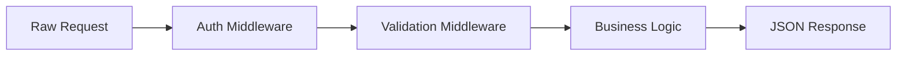

# The Forward Pass

So far, we know that a Neural Network is a series of **Layers** (Middleware) and **Neurons** (Functions). 

The **Forward Pass** is the process where a single piece of data (like an image or a sentence) travels from the Input Layer, through all the hidden layers, and finally reaches the Output Layer to produce a result.

## The Middleware Chain

Think of a standard web request flow:

In a Neural Network, the "Forward Pass" is essentially this process:

1. **Input Stage**: The raw data (e.g., pixels) is converted into an array of numbers (Vectors).
2. **Layer 1 Matrix Multiplication**: The input is multiplied by a set of "Weights" (think of these as configuration flags).
3. **Activation**: An "If/Else" (ReLU) checks if the values are important.
4. **Repeat**: This happens for layer after layer after layer.
5. **Output**: The final layer squishes the numbers into a prediction.

## Why "Forward"?

It’s called "Forward" because the data only travels in one direction: **Input ➔ Output**. There are no loops or backward steps during this stage. 

When you use ChatGPT, you are running a **Forward Pass**. You give it text, it runs it through the layers, and it predicts the next character. 

## The Mathematical "Config" (Weights)

What makes one model "Code-Specialized" and another "Creative" is simply the numbers stored in the **Weights**. 

- **Weights** are like environment variables that control the volume of every signal as it passes through the middleware.
- In a Forward Pass, these weights are **fixed**. We aren't learning anything; we are just executing the "Logic" according to the current config.

> [!NOTE]
> Training (which we will cover soon) is the process of figuring out what these weights should be. The Forward Pass is just "Production" execution.

Next up: How does the AI know it made a mistake? **Loss Functions.**
