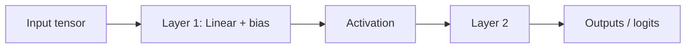

## Definition

The **forward pass** is evaluation: tensors move from input nodes to output nodes through each layer’s operations while **weights stay fixed**. Autograd frameworks may still build a graph for training, but conceptually inference is “run the math once.”

<AnalogyBox
  code="HTTP request processed by middleware chain with immutable env config"
  ai="Forward pass with frozen weights — same graph, same parameters every call"
/>

## What actually runs

Typical blocks include:

- **Linear / conv** — multiply by learned weights, add bias.
- **Normalizations** — LayerNorm/BatchNorm stabilize scale (especially in Transformers).
- **Activations** — element-wise nonlinearities.
- **Attention** — later modules — mixes information across positions.

Each op is just arithmetic on GPUs; the **checkpoint file** supplies the big constant tensors.

## Training vs inference mode

Some layers behave differently when learning:

- **Dropout** — randomly zeros activations during training; disabled during inference.
- **BatchNorm** — uses batch statistics in training, running averages in inference.

<Callout type="warning">
Shipping a model without setting **eval mode** in PyTorch (`model.eval()`) or equivalent is a classic source of flaky production quality — randomness where you expected determinism.
</Callout>

## Cost model (intuition)

FLOPs grow with parameter count, tensor shapes, and sequence length. Transformers add attention’s pairwise interactions — why long context costs more than short context even if parameter count is unchanged.

For service design, the forward pass is what drives **latency**, **VRAM**, and **$/token** — profile it the way you profile hot code paths.

---

## Key takeaways

- **Forward pass** = run the network once with fixed weights.
- Training toggles extra behavior (dropout, gradient tracking); inference should be **deterministic** modulo sampling layers.
- Performance is dominated by **big matrix multiplies** — the same profile as scientific computing, not symbolic AI.

**Next:** [Loss functions →](/tutorials/loss-functions)
